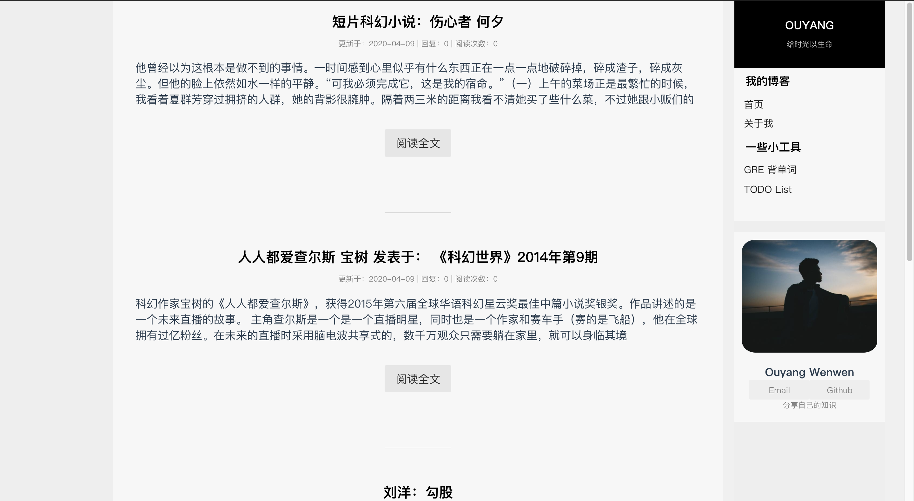
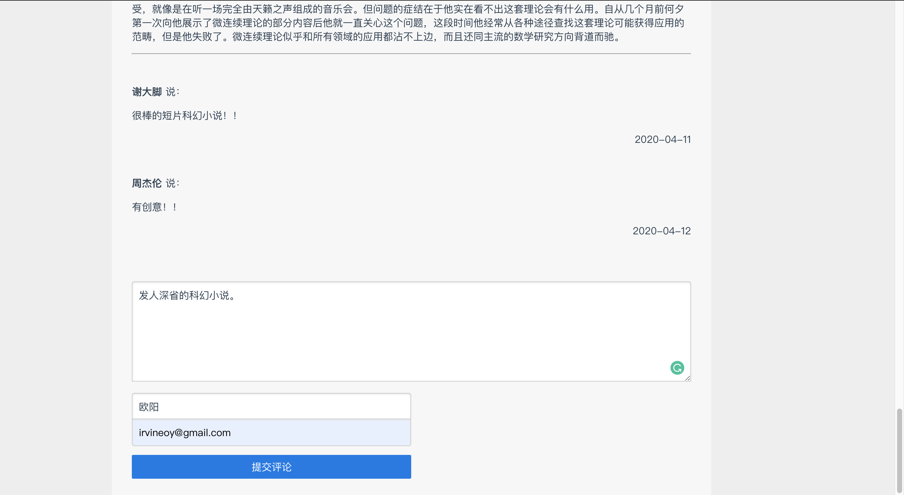
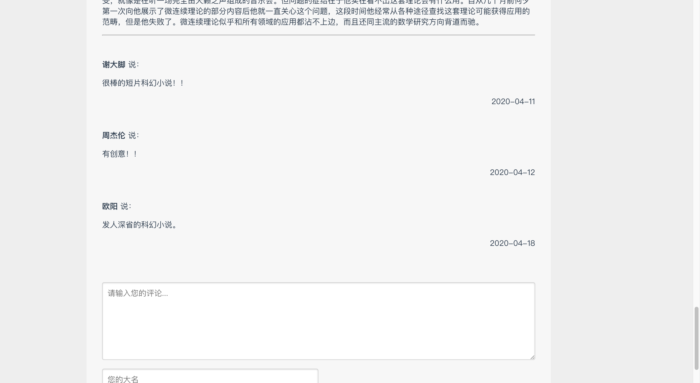

# 这是一个基于vue和django的带有评论功能的博客

## 框架及其版本
 - Django 1.11
 - python3
 - Vue-cli4
 - 数据库: sqlite3

## 界面
### 主界面

### 评论界面

### 展示评论

## 启动
在本地测试时，在blog_backend目录下执行：python3 manage.py runserver 127.0.0.1:8000 

## 踩坑
本地部署测试时，由于浏览器禁止跨域资源共享（CORS），我参照他人的博客定制了一个中间件（blog_backend/middlewares/Mycors.py）来解决CORS问题。
